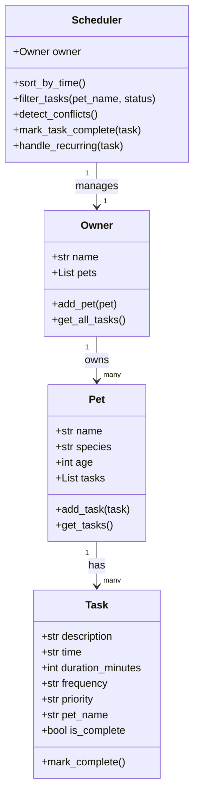

# PawPal+ Project Reflection

## 1. System Design

### Three Core User Actions

1. **Add a pet** — enter a pet's name, species, and age into the system
2. **Schedule a task** — add a care task (like "Morning Walk at 08:00") to a specific pet
3. **See today's schedule** — view all tasks sorted by time across all pets

---

**a. Initial design**

I went with four classes: Task, Pet, Owner, and Scheduler.

Task holds all the info about one care activity — what it is, when it happens, how long it takes, how often it repeats, and how important it is. Pet represents one animal and keeps a list of its tasks. Owner is the person using the app — they have a list of pets and can pull together all the tasks from every pet. Scheduler is the brain that does the actual organizing — sorting tasks by time, filtering them, and checking if two things are scheduled at the same time.

I used Python dataclasses for Task and Pet since they're mostly just data containers, which keeps the code clean.

### UML Diagram (Mermaid.js)

**b. Design changes**

One thing I changed from the original UML was adding a `pet_name` attribute to the `Task` class. At first I didn't include it, but once I started implementing I realized the Scheduler needs to know which pet each task belongs to when it's pulling all tasks together across multiple pets. Without it there'd be no way to tell tasks apart by owner.

---

## 2. Scheduling Logic and Tradeoffs

**a. Constraints and priorities**

The scheduler considers time (when a task is scheduled), priority (high/medium/low), and frequency (once/daily/weekly). Time was the most important constraint since the whole point of the app is building an ordered daily schedule. Priority helps the owner understand what to focus on if things get busy, and frequency drives the recurring task logic. I decided time mattered most because without it you just have a random list, not a schedule.

**b. Tradeoffs**

The conflict detection only flags tasks scheduled at the exact same time (e.g., both at "10:00"). It won't catch a 30-minute task at 10:00 overlapping with one that starts at 10:15. For a pet care app where tasks are short and spread throughout the day, exact-time matching is good enough and keeps the logic simple. Checking for overlapping durations would add a lot more complexity without much real benefit here.

---

## 3. AI Collaboration

**a. How you used AI**

I used AI throughout the whole project — for brainstorming the class structure, generating the UML diagram, scaffolding the class skeletons, and drafting the test suite. The most helpful prompts were specific ones that referenced actual files, like asking Copilot to review `pawpal_system.py` and suggest what was missing. Asking about one thing at a time (e.g., "how should Scheduler retrieve tasks from Owner?") got better answers than broad questions.

**b. Judgment and verification**

At one point AI suggested a full rewrite of `app.py` to connect the backend. I pushed back on that because CodePath gave us the starter file for a reason — the structure was already there and we just needed to wire it up. I verified by going line by line through the original file and only replacing the placeholder logic, keeping everything else intact. That kept the project aligned with what was actually asked.

---

## 4. Testing and Verification

**a. What you tested**

I tested five behaviors: task completion (mark_complete flips the status), task addition (pet task count increases), sorting correctness (tasks come back in time order regardless of how they were added), recurring task creation (a new task is added after completing a daily one), and conflict detection (two tasks at the same time trigger a warning). These were the most important because they cover the core logic the whole app depends on.

**b. Confidence**

Pretty confident — 4 out of 5 stars. All five tests pass and they cover the main happy paths and a couple edge cases. The one thing I'd add next is testing for duration overlaps (e.g., a 30-minute task at 10:00 and another at 10:15) since the current conflict detection only catches exact-time matches.

---

## 5. Reflection

**a. What went well**

The backend logic came together really cleanly. Having the four classes well-defined from the UML made it easy to implement each one without second-guessing the structure. The test suite also felt solid — writing the tests actually helped me catch the bug in `handle_recurring` where `timedelta` was being calculated but never stored.

**b. What you would improve**

I'd give `Task` a proper date field instead of just a time string. Right now recurring tasks get re-added with the same time but there's no actual date tracking, so it's more of a placeholder than a real calendar. With a date field, the recurrence logic would be genuinely useful.

**c. Key takeaway**

The biggest thing I learned is that AI works best when you stay in the driver's seat. When I gave it specific context — a file reference, a clear question — it was really useful. When I just asked vague questions I'd get generic answers. The design had to come from me first; then AI could help fill in the details.
