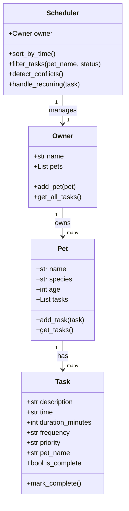

# PawPal+ Project Reflection

## 1. System Design

### Three Core User Actions

1. **Add a pet** — enter a pet's name, species, and age into the system
2. **Schedule a task** — add a care task (like "Morning Walk at 08:00") to a specific pet
3. **See today's schedule** — view all tasks sorted by time across all pets

---

**a. Initial design**

I went with four classes: Task, Pet, Owner, and Scheduler.

Task holds all the info about one care activity — what it is, when it happens, how long it takes, how often it repeats, and how important it is. Pet represents one animal and keeps a list of its tasks. Owner is the person using the app — they have a list of pets and can pull together all the tasks from every pet. Scheduler is the brain that does the actual organizing — sorting tasks by time, filtering them, and checking if two things are scheduled at the same time.

I used Python dataclasses for Task and Pet since they're mostly just data containers, which keeps the code clean.

### UML Diagram (Mermaid.js)

**b. Design changes**

One thing I changed from the original UML was adding a `pet_name` attribute to the `Task` class. At first I didn't include it, but once I started implementing I realized the Scheduler needs to know which pet each task belongs to when it's pulling all tasks together across multiple pets. Without it there'd be no way to tell tasks apart by owner.

---

## 2. Scheduling Logic and Tradeoffs

**a. Constraints and priorities**

- What constraints does your scheduler consider (for example: time, priority, preferences)?
- How did you decide which constraints mattered most?

**b. Tradeoffs**

- Describe one tradeoff your scheduler makes.
- Why is that tradeoff reasonable for this scenario?

---

## 3. AI Collaboration

**a. How you used AI**

- How did you use AI tools during this project (for example: design brainstorming, debugging, refactoring)?
- What kinds of prompts or questions were most helpful?

**b. Judgment and verification**

- Describe one moment where you did not accept an AI suggestion as-is.
- How did you evaluate or verify what the AI suggested?

---

## 4. Testing and Verification

**a. What you tested**

- What behaviors did you test?
- Why were these tests important?

**b. Confidence**

- How confident are you that your scheduler works correctly?
- What edge cases would you test next if you had more time?

---

## 5. Reflection

**a. What went well**

- What part of this project are you most satisfied with?

**b. What you would improve**

- If you had another iteration, what would you improve or redesign?

**c. Key takeaway**

- What is one important thing you learned about designing systems or working with AI on this project?
