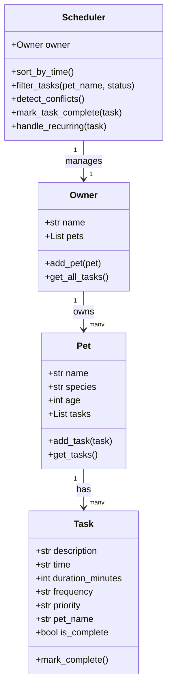

# PawPal+ Final UML Diagram

Updated to reflect final implementation. `mark_task_complete()` was added to Scheduler during Phase 4 to connect task completion with recurring task logic.

> To export as PNG, paste the Mermaid code above into https://mermaid.live and use the Export button.
